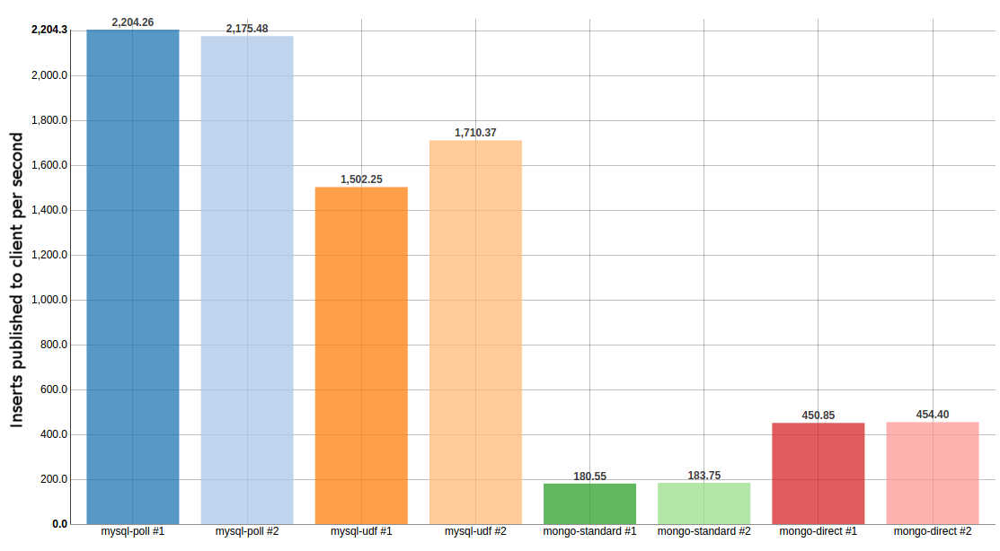

# Implementation Context

In MySQL, triggers can not call the external environment without a UDF (user defined function) that must be compiled for the individual machine and able to be executed by any MySQL user. Please see this [StackOverflow answer about executing external programs from MySQL](http://stackoverflow.com/a/20439489). If you're more interested in trigger practices, be sure to read the linked article, [The Trouble with Triggers](http://www.oracle.com/technetwork/issue-archive/2008/08-sep/o58asktom-101055.html).

Polling a table that is updated by triggers has been chosen as the method to update each select statement as the easiest option to reach. By compiling live-select update queries into `AFTER` triggers on each event (`INSERT`, `UPDATE`, and `DELETE`), a separate table keeps track of last updated triggers keyed by a hash generated from the table name and conditions for each select query published.

## Next Frontier

Multiple paths for notification of updates are available:

Transmission method | Pros | Cons
--------------------|------|-------
Poll Table | <ul><li>Super easy setup</ul> | <ul><li>Requires potentially slow recurring select poll</ul>
UDF TCP Callback | <ul><li>No polling required</ul> | <ul><li>Complicated setup<li>Requires `ROOT` access<li>Requires installing MySQL development packages</ul>
`FILE` privilege export | <ul><li>Simple operation</ul> | <ul><li>Potentially insecure<li>Support blocked on some hosting</ul>
Binary Log | <ul><li>Most similar to Oplog<li>Least intrusive on schema</ul> | <ul><li>MySQL server must be configured to output binary log</ul>

Benchmark comparing 2 repetitions of poll table, UDF callback, Mongo using Meteor interface, and Mongo using [`thinksoftware:mongo-direct` package](https://github.com/thinksoftware/meteor-mongo-direct/):



Slower performance with UDF callback may be due to the fact that every row changed triggers a TCP callback while with the polling table, each row change results in only an update to a memory table value.

### UDF TCP callback

To realize OPLOG-esque integration with MySQL, a UDF written in C/C++ may be compiled and installed on the machine running MySQL server. `sudo` or `root` access is required to install the UDF in MySQL's plugin directory.

Keeping the same package interface, a UDF backed update transmission option would offer lower latency and greater reliability.

Trigger action bodies could change from conditionals that operate on an update polling table like this:

```sql
IF NEW.name = 'Maxwell' THEN
  UPDATE `perf_updates` as p
    JOIN (
      SELECT p1.`update` FROM `perf_updates` as p1
      ORDER BY p1.`update` DESC LIMIT 1) as g
    SET p.`update`= g.`update` + 1
    WHERE `key` = 2103814563;
END IF;
```

To much simpler ones like this that would instantly broadcast updates to Meteor:
```sql
IF NEW.name = 'Maxwell' THEN
  DO meteor_update(3303291040);
END IF;
```

See the [main readme about `initUpdateServer()`](https://github.com/numtel/meteor-mysql#connectioninitupdateserverport-hostname)...

### `FILE` privilege

MySQL supports a `FILE` privilege on users that allows data to be read and written to the filesystem. The use of this privilege presents a security risk and is not supported by many hosting providers.

### Binary log

Obtain direct log of changes to database.

By using Statement-Based replication, the binary log can be tailed. This process can be slow though: a file (that can grow to be many gigabytes) must be watched for new statements or rows. Found solutions for MySQL binlog tailing in Javascript utilize the `watch()` or `watchFile()` method of the `fs` module, polling for changes to the [statistics of the] file.

* [Script that uses `mysqlbinlog`](https://gist.github.com/petethomas/1572119) - Example of using `mysqlbinlog` command line interpreter included with MySQL
* [Another script](https://gist.github.com/laverdet/958588) - Does not work in my tests, but it looks like it would parse a binlog in `statement` mode. `statement` mode results in a smaller replication log but for determining when to refresh a `select` statement, `row` mode is required unless a full replication of the data is kept.
* [ZongJi NPM module](https://github.com/nevill/zongji) - Similar to the first example that uses `mysqlbinlog` except the binlog parser is written entirely in Javascript. Very promising but not finished, many column types still need to be supported.
* [Hupu NPM module](https://github.com/HupuInc/node-mysql-listener) - Not tested but requires C++ compilation so probably not a good option as `sudo` or `root` would be required for installation along with the MySQL development package.

The main advantage to using the Binlog would be to enable updates without modifying the underlying database with triggers. Theoretically, realizing Binlog updates appears as an ultimate solution to Meteor-MySQL integration but benchmarks and real world performance are necessary to tell the full story.

## Postgres Sequel

Postgres allows functions accessing external resources to be written using `plperlu` scripts (only as a super user). More research is required to determine whether this a path to a reactive Postgres integration without polling a table.

